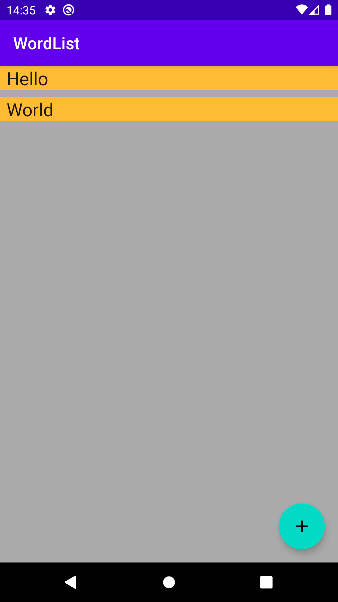
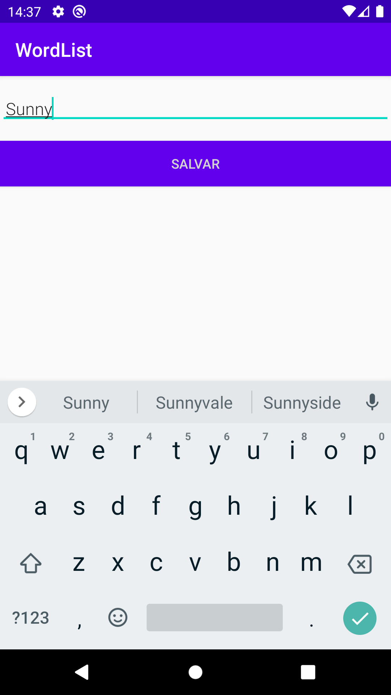
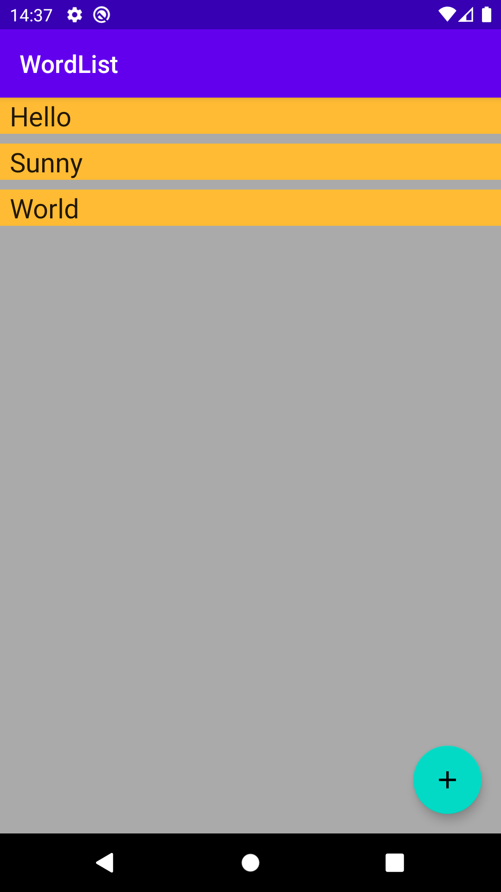
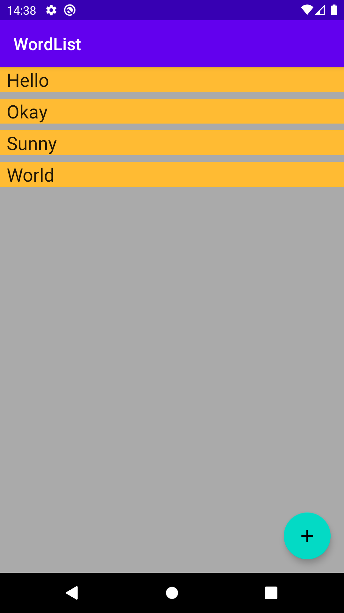

# wordlist-kotlin

This is a sample app that records (in memory) and shows a sorted list of words.

*Using: AndroidX, Coroutines, Room, LiveData, MaterialDesign and JUnit.*

## ScreenShots

    

## Contributing
Pull requests are welcome. For major changes, please open an issue first to discuss what you would like to change.

Please make sure to update tests as appropriate.